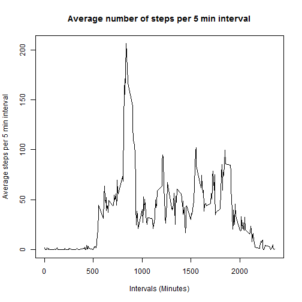

# Peer Assessment 1

==================================================

Reading the file. In order to read the file with the following code
it has to be downloaded in our working directory

```r
activity<-read.csv("./activity.csv")
```
Calculating total number of steps taken per day

```r
library("dplyr")
activity1<- activity %>%
    group_by(date) %>%
    summarize(totals=sum(steps,na.rm=TRUE))
```
Creating histogram of the total number of steps taken each day

```r
hist(activity1$totals, main="Histogram of total numbers of steps per day",xlab="Steps per day",ylab="Frequency(Number of days)")
```

 
Calculate and report the mean and median of the total number of steps taken per day
the "mean" and "median" for the total number of steps taken across the 61 days (2012-10-01 to 2012-11-30)


```r
activity2 <- activity1 %>%
    summarize(mean_day=mean(totals,na.rm=TRUE),
              median_day=median(totals,na.rm=TRUE)
              )
print(activity2)
```

```
## Source: local data frame [1 x 2]
## 
##   mean_day median_day
##      (dbl)      (int)
## 1  9354.23      10395
```
Make a time series plot (i.e. type = "l") of the 5-minute interval (x-axis) 
and the average number of steps taken, averaged across all days (y-axis)

```r
activity3<- activity %>%
    group_by(interval) %>%
    summarize(average=mean(steps,na.rm=TRUE))

with(activity3,plot(interval,average,type="l",main="Average number of steps per 5 min interval",ylab="Average steps per 5 min interval", xlab="Intervals (Minutes)"))
```

 
Which 5-minute interval, on average across all the days in the dataset, contains the maximum number of steps?

```r
filter(activity3,average==max(average))
```

```
## Source: local data frame [1 x 2]
## 
##   interval  average
##      (int)    (dbl)
## 1      835 206.1698
```

Calculate and report the total number of missing values in the dataset (i.e. the total number of rows with NAs)


```r
sum(is.na(activity$steps))
```

```
## [1] 2304
```

Devise a strategy for filling in all of the missing values in the dataset.
We should use the average steps across the days per each interval (activity3) 
and fill up the NAs from the original dataset (activity) with those averages.
Adding an extra column "complete" to the origianl dataset


```r
activity$complete <- ifelse(is.na(activity$steps),activity$complete<-activity3$average,activity$steps) 
```

Make a histogram of the total number of steps taken each day including the missing values filled in.


```r
act_complete<-activity %>% 
    group_by(date)%>% 
    summarize(totals=sum(complete)) 

hist(act_complete$totals, main="Histogram of total numbers of steps per day",xlab="Steps per day",ylab="Frequency(Number of days)") 
```

 

Calculate and report the mean and median total number of steps taken per day


```r
act_summary<-act_complete %>% 
    summarize(mean=mean(totals), 
              median=median(totals)) 

print(act_summary)
```

```
## Source: local data frame [1 x 2]
## 
##       mean   median
##      (dbl)    (dbl)
## 1 10766.19 10766.19
```

Observation 1: Mean and Median are slightly higher than the original dtaset with missing values. 
Also for the second dataset with filled in averages the mean equals the median.
Observation 2: For the second dataset (with filled in average steps) 
the histogram seems to be more normally distributed (with concentration of most most frequent accurance in the middle - between 10K and 15K steps)


Create a new factor variable in the dataset with two levels - "weekday" and "weekend" indicating whether a given date is a weekday or weekend day.


```r
activity$date1<-as.Date(as.character(activity$date, "%Y%m%d")) 
activity$days<-weekdays(activity$date1) 

activity$week_ends <- ifelse(activity$days== "Saturday" | activity$days== "Sunday",activity$week_ends<-"Weekends",activity$week_ends<-"Weekdays") 

activity4<-activity %>% 
    group_by(interval,week_ends)%>% 
    summarize(average_steps=mean(complete)) 
```

Make a panel plot containing a time series plot (i.e. type = "l") of the 5-minute interval (x-axis) and the average number of steps taken, 
averaged across all weekday days or weekend days (y-axis). 


```r
library("ggplot2") 
qplot(interval, average_steps,data=activity4,facets=week_ends~.,geom = "Line") 
```

 
